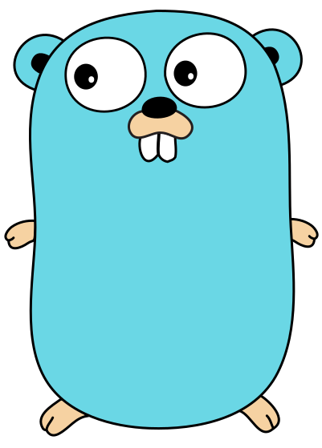

# Logan Pritchett

<table border="0">
  <tr>
    <td width="60%">
      <h2>About Me</h2>
      
I'm a chemical engineering student turned software engineer. I am passionate about all things software and technology, and I am always looking to learn more.

      <!--<h3>Are you a recruiter? <a href="#connect">Let's Connect!</a></h3>-->
    </td>
    <td width="40%" align="center">
      
    </td>
  </tr>
</table>

## What I Use 💻

<table align="center">
  <tr>
    <td align="center">
      <h3>&nbsp;My Editors of Choice&nbsp;</h3>
      

        &nbsp;
        
      

    </td>
    <td align="center">
      <h3>My Current Stack</h3>
      

        &nbsp;
        &nbsp;
        &nbsp;
        &nbsp;
        <picture>
          <source media="(prefers-color-scheme: dark)" srcset="./images/express/dark.svg" height="50" />
          <source media="(prefers-color-scheme: light)" srcset="./images/express/light.svg" height="50" />
          
        </picture>&nbsp;
        
      

    </td>
  </tr>
</table>

## What I Know 🧠

<table align="center">
  <tr>
    <th>Languages</th>
    <td>
      &nbsp;
      &nbsp;
      &nbsp;
      
    </td>
  </tr>
  <tr>
    <th>Frontend Frameworks & Libraries</th>
    <td>
      &nbsp;
      &nbsp;
      &nbsp;
      &nbsp;
      
    </td>
  </tr>
  <tr>
    <th>Backend & Database</th>
    <td>
      &nbsp;
      <picture>
        <source media="(prefers-color-scheme: dark)" srcset="./images/express/dark.svg" height="50" />
        <source media="(prefers-color-scheme: light)" srcset="./images/express/light.svg" height="50" />
        
      </picture>&nbsp;
      &nbsp;
      
    </td>
  </tr>
  <tr>
    <th>Testing & Development</th>
    <td>
      &nbsp;
      &nbsp;
      
    </td>
  </tr>
  <tr>
    <th>Package Managers</th>
    <td>
      &nbsp;
      <picture>
        <source media="(prefers-color-scheme: dark)" srcset="./images/pnpm/dark.svg" height="50" />
        <source media="(prefers-color-scheme: light)" srcset="./images/pnpm/light.svg" height="50" />
        
      </picture>&nbsp;
      
    </td>
  </tr>
  <tr>
    <th>Deployment & Hosting</th>
    <td>
      <picture>
        <source media="(prefers-color-scheme: dark)" srcset="./images/vercel/dark.svg" height="50" />
        <source media="(prefers-color-scheme: light)" srcset="./images/vercel/light.svg" height="50" />
        
      </picture>&nbsp;
      <picture>
        <source media="(prefers-color-scheme: dark)" srcset="./images/render/dark.svg" height="50" />
        <source media="(prefers-color-scheme: light)" srcset="./images/render/light.svg" height="50" />
        
      </picture>&nbsp;
      &nbsp;
      
    </td>
  </tr>
  <tr>
    <th>Version Control</th>
    <td>
      &nbsp;
      <picture>
        <source media="(prefers-color-scheme: dark)" srcset="./images/github/dark.svg" height="50" />
        <source media="(prefers-color-scheme: light)" srcset="./images/github/light.svg" height="50" />
        
      </picture>
    </td>
  </tr>
  <tr>
    <th>Development Tools</th>
    <td>
      &nbsp;
      
    </td>
  </tr>
  <tr>
    <th>AI Tools</th>
    <td>
      &nbsp;
      <picture>
        <source media="(prefers-color-scheme: dark)" srcset="./images/chatgpt/dark.svg" height="50" />
        <source media="(prefers-color-scheme: light)" srcset="./images/chatgpt/light.svg" height="50" />
        
      </picture>&nbsp;
      &nbsp;
      &nbsp;
      <picture>
        <source media="(prefers-color-scheme: dark)" srcset="./images/ollama/dark.svg" height="50" />
        <source media="(prefers-color-scheme: light)" srcset="./images/ollama/light.svg" height="50" />
        
      </picture>&nbsp;
      <picture>
        <source media="(prefers-color-scheme: dark)" srcset="./images/v0/dark.svg" height="50" />
        <source media="(prefers-color-scheme: light)" srcset="./images/v0/light.svg" height="50" />
        
      </picture>&nbsp;
      <picture>
        <source media="(prefers-color-scheme: dark)" srcset="./images/bolt/dark.svg" height="50" />
        <source media="(prefers-color-scheme: light)" srcset="./images/bolt/light.svg" height="50" />
        
      </picture>
    </td>
  </tr>
</table>

## What I'm Learning 📚

  &nbsp;&nbsp;
  &nbsp;&nbsp;
  

<h2 id="connect">Let's Connect 🤝</h2>

  &nbsp;&nbsp;
  &nbsp;&nbsp;

---

  

